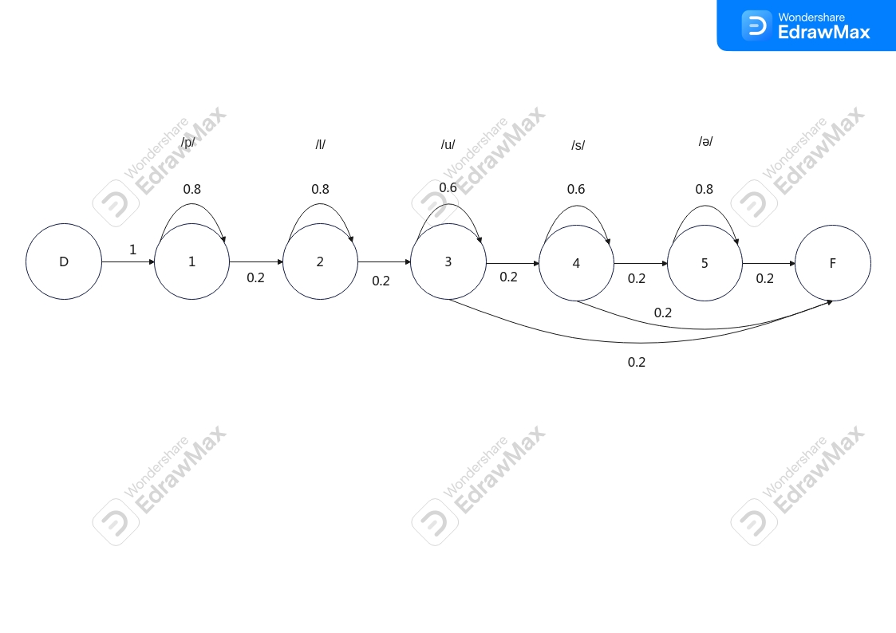

🎙️ Calculette Commandable Vocalement (HMM)

📖 Présentation du Projet

L'objectif de ce projet est de concevoir et réaliser une calculette commandable par la voix. Le système est capable d'écouter un signal acoustique, de décoder les mots prononcés (chiffres et opérateurs), puis d'interpréter la commande mathématique.

Le cœur de notre système de reconnaissance vocale repose sur la modélisation acoustico-phonétique à l'aide des Modèles de Markov Cachés (HMM).
🧠 Modélisation Acoustico-Phonétique (HMM)

Pour identifier les mots prononcés, nous avons construit une topologie de décision basée sur le nombre de phonèmes de chaque mot. Le processus de modélisation suit ces principes :

    États du modèle : Chaque modèle de Markov caché est constitué d'un état de début (D), d'un état de fin (F), et d'un ensemble d'états émetteurs.

    Correspondance Phonème/État : Chaque état émetteur a pour charge de reconnaître un phonème spécifique. Par exemple, pour un mot composé de 3 phonèmes, le modèle comportera 5 états au total (3 états émetteurs + D + F).

    Variations de prononciation : Les modèles prennent en compte les différentes prononciations possibles d'un même mot à l'oral (par exemple, la prononciation ou l'omission du "e" muet).

Exemples de Topologies

Voici quelques exemples illustrant la structure de nos HMM selon les variations phonétiques :

Modèle de l'opérateur + ("plus")

    Prononciations : /plus/ (4 phonèmes), /plusə/ (5 phonèmes) ou /plu/ (3 phonèmes).

(Note : Les images complètes de la topologie de chaque mot (de 0 à 9, plus et moins) sont disponibles dans le dépôt).

🗣️ Grammaire de la Calculette

Afin de lier les mots reconnus et de former des requêtes compréhensibles par la machine, une grammaire stricte a été définie. Elle permet de structurer les phrases acceptées par le système.
Plaintext

📊 Évaluation et Résultats

Le système a été évalué sur un jeu de données de test et démontre une excellente capacité d'identification :

    Précision (Accuracy) : Le modèle atteint une précision globale de 97.50%.

    Analyse des confusions : La matrice de confusion a révélé de légères ambiguïtés entre les couples (un, cinq) et (un, quatre).

    Optimisation : Ces confusions s'expliquent par des similarités phonétiques (comme le phonème /ɛ̃/) et structurelles entre les modèles initiaux. L'adoption d'un second modèle plus strict pour le mot "un" (alignant parfaitement le nombre d'états émetteurs au nombre de phonèmes) a permis de réduire ces ressemblances.
